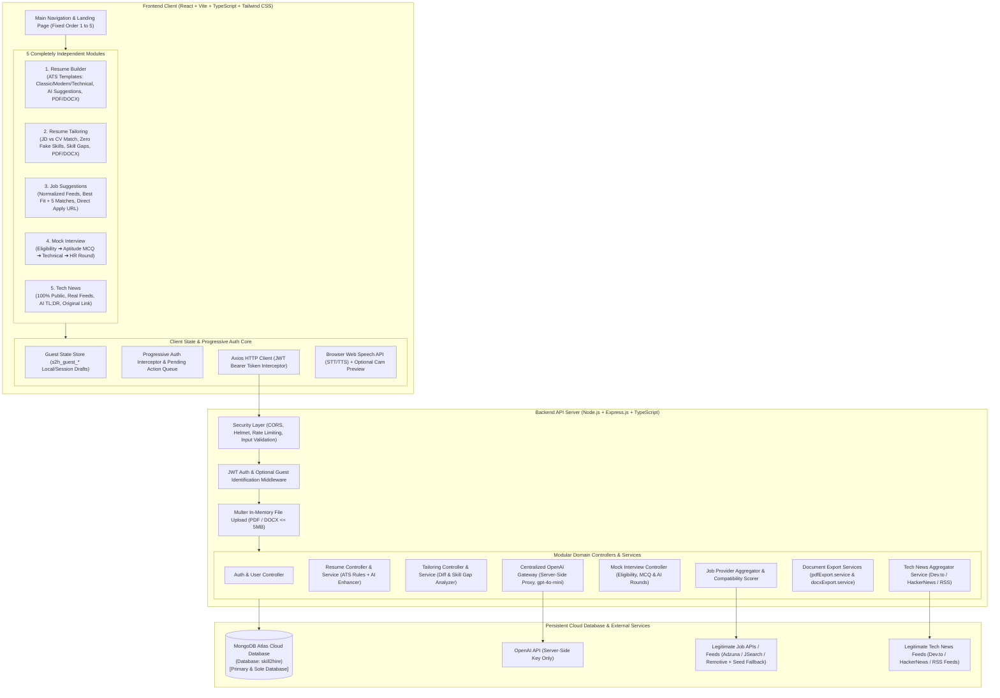
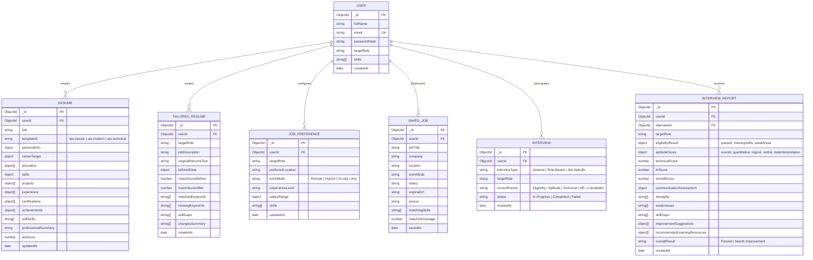
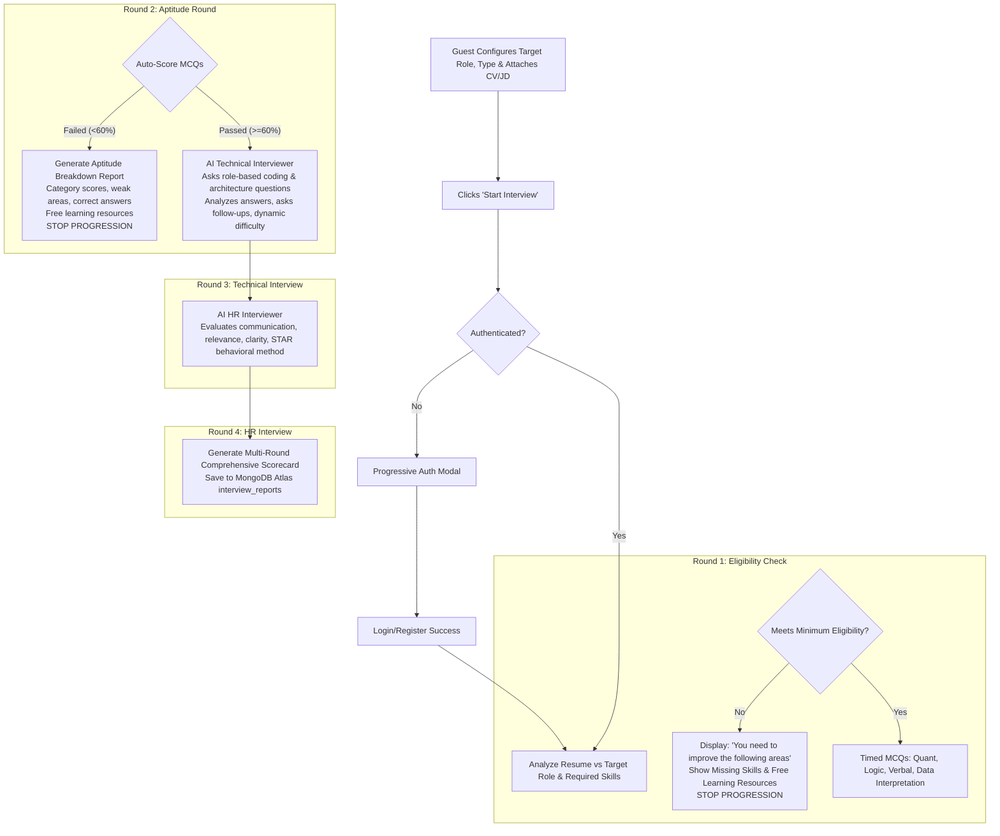

# Skill2Hire — Master Architecture & Implementation Plan (Refined)
**CSE Final-Year Capstone Project**

---

## Executive Summary & Architecture Philosophy

**Skill2Hire** is a student-centric, AI-powered career companion built as a CSE final-year capstone project. It provides **five completely independent career-related modules** designed around clean modular-monolith principles, high ATS compatibility, defensible AI evaluation, and effortless live demonstration during project presentation / viva.

### Core Architectural Principles
1. **Module Independence (Loose Coupling):** The five modules are completely independent. A user can open and use any module directly without prerequisite completion of any other module.
   - **Module 1:** Resume Builder
   - **Module 2:** Resume Tailoring
   - **Module 3:** Job Suggestions
   - **Module 4:** Mock Interview
   - **Module 5:** Tech News
   *(Module order everywhere is strictly: 1. Resume Builder $\rightarrow$ 2. Resume Tailoring $\rightarrow$ 3. Job Suggestions $\rightarrow$ 4. Mock Interview $\rightarrow$ 5. Tech News. Optional non-mandatory shortcuts exist between modules.)*
2. **Lazy / Progressive Registration (Unchanged & Preserved):** 100% guest exploration with zero barriers. Authentication is prompted **only** at specific final action points (Resume/Tailored download, Job search execution, Starting mock interview). Guest data is preserved in temporary storage and automatically restored/saved upon signup/login. Tech News is 100% public with no auth.
3. **MongoDB Atlas as the Sole Database:** Zero local MongoDB requirement. Direct cloud connection via `MONGODB_URI` from `.env`. Clean, understandable schemas (`users`, `resumes`, `tailored_resumes`, `job_preferences`, `saved_jobs`, `interviews`, `interview_reports`) with built-in demo seeding for viva presentations.
4. **No Over-Engineering:** Clean Node/Express + React/Vite + MongoDB Atlas stack. No Redis, Kubernetes, or microservices complexity.

---

## 1. System Architecture



---

## 2. Frontend Architecture

### Technology Stack & Design Principles
- **Framework & Build:** React 18+ with Vite (TypeScript strict mode)
- **Styling:** Tailwind CSS (Clean, modern, responsive typography and layout)
- **Icons:** Lucide React
- **Routing:** React Router v6 (Feature-based lazy-loaded routes)
- **HTTP Client:** Axios (Interceptors for JWT token injection and standardized error extraction)
- **Exporting Libraries:** Client-side `@react-pdf/renderer` + server-side binary stream fallbacks for PDF & DOCX.

### Feature-Based Folder Structure (`frontend/src/`)
```
frontend/src/
├── assets/                  # Logos, icons, template preview thumbnails
├── components/              # Global shared UI components
│   ├── common/              # Navbar, Footer, Button, Card, Badge, Modal, Toast, Loader
│   ├── auth/                # LoginModal, RegisterModal, ProgressiveAuthTrigger
│   └── form/                # Input, Select, Textarea, Dropzone, TagInput
├── context/                 # AuthContext (User state, JWT token, guest restore trigger)
├── hooks/                   # useSpeechRecognition, useSpeechSynthesis, useMediaStream, useDebounce
├── layouts/                 # RootLayout (Navbar + Main + Footer)
├── modules/                 # 5 FEATURE-BASED INDEPENDENT MODULES
│   ├── resume-builder/      # Components, Pages, State, Types, ATS templates (Classic, Modern, Tech)
│   ├── resume-tailoring/    # Components, Pages, State, Types, Diff/Gap viewer
│   ├── job-suggestions/     # Components, Pages, State, Types, Normalized Job Cards
│   ├── mock-interview/      # Components, Pages, State, Types, Rounds (Eligibility, MCQ, Tech, HR)
│   └── tech-news/           # Components, Pages, State, Types, Category feeds
├── pages/                   # LandingPage, DashboardPage, ProfilePage, NotFoundPage
├── services/                # api.ts (Central Axios instance)
├── types/                   # Global TypeScript definitions
└── utils/                   # pdfGenerator.ts, docxGenerator.ts, atsScorer.ts, validators.ts
```

---

## 3. Backend Architecture

### Design Pattern: Modular Controller-Service-Repository
Strict separation of concerns prevents business logic from polluting Express route files.

```
HTTP Request 
   ⬇️
[Security & Rate Limiting Middleware (Helmet, CORS, Express-Rate-Limit)]
   ⬇️
[Authentication Middleware (JWT / Optional Guest)]
   ⬇️
[Express-Validator / Zod Input Validation]
   ⬇️
[Domain Controller (HTTP status, input extraction, response formatting)]
   ⬇️
[Domain Service (Business rules, ATS formulas, AI calls, DB queries)]
   ⬇️
[Mongoose Model ⇄ MongoDB Atlas Cloud / OpenAI API / External Providers]
   ⬇️
Standardized JSON Response: { success: true, message: string, data: T }
```

### Backend Structure (`server/`)
```
server/
├── config/                  # db.ts (Atlas connection), env.ts, openai.ts
├── constants/               # prompts.ts, aptitudeQuestions.ts, errorMessages.ts
├── controllers/             # auth.controller.ts, resume.controller.ts, tailor.controller.ts,
│                            # job.controller.ts, interview.controller.ts, news.controller.ts
├── middleware/              # auth.middleware.ts, optionalAuth.middleware.ts, 
│                            # rateLimiter.ts, upload.middleware.ts, error.middleware.ts
├── models/                  # User.ts, Resume.ts, TailoredResume.ts, JobPreference.ts,
│                            # SavedJob.ts, Interview.ts, InterviewReport.ts
├── routes/                  # auth.routes.ts, resume.routes.ts, tailor.routes.ts,
│                            # job.routes.ts, interview.routes.ts, news.routes.ts
├── services/                # aiService.ts, resumeSuggestionService.ts, resumeAnalysisService.ts,
│                            # resumeTailoringService.ts, jobAggregator.service.ts,
│                            # interviewService.ts, newsSummaryService.ts, parserService.ts,
│                            # pdfExport.service.ts, docxExport.service.ts
├── types/                   # Request/Response TypeScript interfaces
├── utils/                   # jwt.ts, logger.ts, seedData.ts
└── server.ts                # Express application bootstrap & port listener
```

---

## 4. MongoDB Atlas Database Schemas (Primary & Sole Database)

MongoDB Atlas is the **only** database required. Schemas are purposefully designed for clarity, relational referencing via ObjectIds, and simple explanation during viva examination.



---

## 5. REST API Structure & File Export Endpoints

All responses follow the envelope: `{ success: boolean, message?: string, data?: any, error?: any }`.

### 1. Authentication Endpoints (`/api/auth`)
- `POST /api/auth/register` — Register new user (bcrypt password hash).
- `POST /api/auth/login` — Authenticate user and issue JWT token.
- `GET /api/auth/profile` — Get authenticated user profile and preferences.
- `POST /api/auth/logout` — Client-side token invalidation acknowledgment.

### 2. Resume Builder Endpoints (`/api/resumes`)
- `POST /api/resumes/ai-suggestions` *(Public/Guest)* — AI bullet improvements, summary enhancement, or specialization suggestions (anti-hallucination guardrails).
- `POST /api/resumes/ats-analysis` *(Public/Guest)* — Compute measurable ATS compatibility score and keyword breakdown.
- `POST /api/resumes` *(Auth)* — Save draft/complete resume to user's Atlas account.
- `GET /api/resumes` *(Auth)* — List user's resumes.
- `GET /api/resumes/:id` *(Auth)* — Fetch specific resume.
- `PUT /api/resumes/:id` *(Auth)* — Update resume.
- `DELETE /api/resumes/:id` *(Auth)* — Delete resume.
- **`POST /api/resumes/export-pdf`** *(Auth)* — Generate and download ATS-friendly PDF.
- **`POST /api/resumes/export-docx`** *(Auth)* — Generate and download editable DOCX file.

### 3. Resume Tailoring Endpoints (`/api/tailor-resume`)
- `POST /api/tailor-resume/upload-parse` *(Public/Guest)* — Upload PDF/DOCX and extract structured text.
- `POST /api/tailor-resume/ats-analysis` *(Public/Guest)* — Compare resume against JD; return Before/After scores & skill gaps.
- `POST /api/tailor-resume/generate` *(Public/Guest)* — Generate tailored bullet points & aligned skills without inventing skills.
- `POST /api/tailor-resume` *(Auth)* — Save tailored resume record to MongoDB Atlas.
- `GET /api/tailor-resume` *(Auth)* — List saved tailored resumes.
- `GET /api/tailor-resume/:id` *(Auth)* — Fetch tailored resume record.
- **`POST /api/tailor-resume/export-pdf`** *(Auth)* — Download tailored resume as ATS PDF.
- **`POST /api/tailor-resume/export-docx`** *(Auth)* — Download tailored resume as editable DOCX.

### 4. Job Suggestions Endpoints (`/api/jobs`)
- `POST /api/jobs/search` *(Auth)* — Query normalized job aggregator (Adzuna / JSearch / Remotive + Seed fallback) using preferences & candidate skills.
- `GET /api/jobs/recommendations` *(Auth)* — Get top 1 "Best Fit" + "5 Good Matches" ranked by compatibility.
- `POST /api/jobs/save` *(Auth)* — Bookmark job to user's dashboard.
- `GET /api/jobs/saved` *(Auth)* — List bookmarked jobs.
- `DELETE /api/jobs/saved/:id` *(Auth)* — Remove bookmarked job.

### 5. Mock Interview Endpoints (`/api/interviews`)
- `POST /api/interviews/check-eligibility` *(Auth)* — Evaluate candidate resume & target role against minimum requirements.
- `POST /api/interviews/aptitude-questions` *(Auth)* — Fetch timed MCQs across Quant, Logical Reasoning, Verbal Ability, DI.
- `POST /api/interviews/aptitude-submit` *(Auth)* — Automatically grade aptitude MCQs and return pass/fail + category analysis.
- `POST /api/interviews/technical-turn` *(Auth)* — AI interviewer asks dynamic role-based technical questions and evaluates answers.
- `POST /api/interviews/hr-turn` *(Auth)* — AI HR interviewer evaluates behavioral communication, clarity, and STAR responses.
- `POST /api/interviews/reports` *(Auth)* — Generate and persist multi-round comprehensive scorecard in Atlas.
- `GET /api/interviews/reports` *(Auth)* — Fetch past interview reports.

### 6. Tech News Endpoints (`/api/news`)
- `GET /api/news` *(100% Public)* — Fetch latest tech news by category (AI, Software Dev, Cyber, Cloud, Startups, IT Jobs, Trends).
- `GET /api/news/:id` *(100% Public)* — Get article with AI 3-bullet takeaway and direct original URL.

---

## 6. Lazy / Progressive Registration Architecture (Preserved Exactly)

The lazy registration architecture is kept **100% unchanged** from the original design:

| Module | Guest Allowed Actions | Registration Trigger Point | Post-Auth Action |
| :--- | :--- | :--- | :--- |
| **1. Resume Builder** | Enter all details, AI suggestions, ATS analysis, live preview, template changes | **Clicking "Download PDF" or "Download DOCX"** | Restores resume data, triggers download, saves to Atlas account |
| **2. Resume Tailoring** | Enter JD, upload/select resume, AI tailoring, ATS analysis, diff preview | **Clicking "Download PDF" or "Download DOCX"** | Restores tailored resume, triggers download, saves to Atlas |
| **3. Job Suggestions** | Open module, configure role/location/mode/salary/experience filters, attach CV | **Clicking "Search Jobs"** | Preserves preferences & CV, executes search automatically |
| **4. Mock Interview** | Open module, select target role, interview type, rounds, difficulty, attach CV/JD | **Clicking "Start Interview"** | Preserves configuration, launches Eligibility $\rightarrow$ Aptitude $\rightarrow$ Tech $\rightarrow$ HR |
| **5. Tech News** | Browse, search, filter categories, read AI summaries, open source links | **NEVER** (100% Public) | N/A |

### Guest Data Preservation Mechanism
- State drafts are stored in browser storage under `s2h_guest_resume_draft`, `s2h_guest_tailor_draft`, `s2h_guest_job_pref`, and `s2h_guest_interview_cfg`.
- Active action intent is placed in `s2h_pending_action`.
- Upon successful signup or login, the `AuthContext` detects the pending action, automatically saves the document to MongoDB Atlas, executes the pending action (download/search/start), and cleans up temporary keys.

---

## 7. ATS Resume Template Architecture

To maximize real ATS parser compatibility, decorative/multi-column templates are replaced with **3 ATS-Friendly Single-Column Templates**:

1. **ATS Classic:**
   - Single-column traditional format, standard serif/sans-serif typography (Times New Roman / Arial / Calibri style), bold uppercase section headings with solid divider lines, standard bullet formatting. Top-ranked for traditional enterprise and high-volume ATS parsers.
2. **ATS Modern:**
   - Sleek single-column layout with clean Inter/Roboto typography, subtle horizontal dividers, highlighted contact info pill header, clear skill groupings (Languages, Frameworks, Databases, Tools), and metric-emphasized bullet points.
3. **ATS Technical:**
   - Developer-tailored single-column structure emphasizing Technical Skills matrix at the top, followed by Featured Projects with tech stack badges, Work Experience with impact metrics, and Education/Certifications.

### ATS Design Principles
- Single-column linear reading order (no multi-column bounding boxes that confuse parsers).
- Standard section headers: `Professional Summary`, `Technical Skills`, `Work Experience`, `Projects`, `Education`, `Certifications`.
- Selectable, searchable text (no rasterized text or complex canvas layers).
- Clean margins (0.75" / 0.5") and consistent line spacing.

---

## 8. Measurable ATS Analysis Engine

Skill2Hire combines **measurable rule-based analysis** with AI assistance rather than generating arbitrary numbers:

$$\text{Skill2Hire ATS Score} = w_1 S_{\text{completeness}} + w_2 S_{\text{keywords}} + w_3 S_{\text{skills}} + w_4 S_{\text{structure}} + w_5 S_{\text{formatting}}$$

Where:
1. **Section Completeness ($S_{\text{completeness}}$, 25%):** Checks existence and depth of Personal Info, Career Target, Education, Categorized Skills, Projects, and Experience.
2. **Keyword Relevance ($S_{\text{keywords}}$, 25%):** Density and presence of role-specific keywords against standardized domain taxonomies.
3. **Skills Match ($S_{\text{skills}}$, 25%):** Core technical competencies vs. industry-standard requirements for the target role.
4. **Structure & Headings ($S_{\text{structure}}$, 15%):** Compliance with recognized ATS standard heading titles and chronological formatting.
5. **Formatting & Action Verbs ($S_{\text{formatting}}$, 10%):** Use of strong action verbs (Google X-Y-Z formula), quantified metrics (%, $, numbers), and avoidance of parsing pitfalls.

- **Output Report:** Displays *Skill2Hire ATS Compatibility Score* (0–100), matched keywords list, missing critical keywords, category-wise skill breakdown, section-by-section warnings, and actionable recommendations.
- **Disclaimer:** Explicitly labelled as a *"Skill2Hire ATS Compatibility Score — an algorithmic estimation of resume structure and keyword readiness, not an endorsement by any specific proprietary ATS."*

---

## 9. AI Resume Tailoring & Zero Fake Skills Guardrail

The Tailoring engine compares:
$$\text{Job Role} + \text{Job Description} + \text{Job Requirements} + \text{Candidate Resume}$$

### Tailoring Rules
1. **Prioritization:** Re-orders existing projects and experience bullets to emphasize achievements directly relevant to the JD.
2. **Bullet Enhancement:** Rephrases raw bullet points using JD-aligned terminology without altering factual content.
3. **Zero Fake Skills Rule:**
   - If a JD requires a skill (e.g. *Docker*, *AWS*, *Kafka*) that is absent in the candidate's resume, the system **NEVER** injects it into the resume.
   - It is explicitly highlighted under a dedicated **Skill Gaps** panel with recommended learning steps.
4. **Deliverables:** Original ATS Compatibility Score, Tailored ATS Compatibility Score, Matched Keywords, Missing Keywords, Identified Skill Gaps, Summary of Major Changes Made, Live Preview, and PDF/DOCX Export.

---

## 10. Job Suggestion Architecture (Normalized Job Aggregator)

The job architecture uses a dedicated **`jobAggregator.service.ts`** that aggregates legitimate APIs, permitted public feeds, and approved data providers without unauthorized scraping.

### Normalized Job Interface
```typescript
interface Job {
  id: string;
  title: string;
  company: string;
  location: string;
  workMode: 'Remote' | 'Hybrid' | 'On-site';
  salary: string;
  experience: string;
  description: string;
  skills: string[];
  source: string;
  applicationUrl: string;
  postedDate: string;
  matchPercentage?: number;
  matchingSkills?: string[];
  missingSkills?: string[];
  matchReason?: string;
}
```

### Job Ranking & Display
- **Matching Criteria:** Candidate skills $\cap$ Job required skills, target role similarity, experience level match, location/work mode match.
- **Presentation:**
  - 🌟 **BEST FIT JOB:** Featured banner with top overall compatibility score, highlight reasons, matching skills, and missing skills.
  - 📋 **5 GOOD MATCHES:** Ranked cards with match percentage badges and skill alignment indicators.
- **Original Source Redirection:** The "Apply" button directly opens `applicationUrl` in a new tab. Skill2Hire never fakes automated job submissions.
- **Seed / Viva Fallback:** If third-party API quotas or network limits occur during demonstration, `jobAggregator.service.ts` seamlessly serves realistic normalized tech jobs to ensure zero disruption.

---

## 11. Mock Interview: 4-Round Structured Architecture

The Mock Interview flow implements a 4-round progression with clear gating criteria:



### Voice & Camera Specifications
- **Speech Flow:** User Speaks $\rightarrow$ Web Speech API Speech-to-Text $\rightarrow$ Text submitted to Express Backend $\rightarrow$ OpenAI analysis $\rightarrow$ Next question generated $\rightarrow$ Text-to-Speech audio output.
- **Camera Access:** 100% **OPTIONAL**. If enabled, limited strictly to technical presentation indicators (e.g. video feed preview). No pseudo-scientific claims regarding personality, honesty, or mental health.
- **Text Fallback:** Candidates can smoothly switch between voice and text input at any moment.

---

## 12. Tech News Architecture

- **100% Public Access:** No registration prompt under any circumstance.
- **Legitimate Ingestion:** Consumes official Dev.to API, HackerNews Firebase API, and tech RSS feeds.
- **Content Fields:** Headline, original source name, publication date, category badge, AI 3-bullet developer TL;DR, and direct clickable URL to the full original article.
- **Categories:** Artificial Intelligence, Software Development, Cybersecurity, Cloud, Startups, IT Jobs/Hiring/Layoffs, Programming, Technology Trends.

---

## 13. File Upload & Export Security

### File Uploads (PDF & DOCX)
- **Supported:** Resume parsing in Builder & Tailoring modules.
- **Validation:** File size capped at 5MB, strict MIME check (`application/pdf`, `application/vnd.openxmlformats-officedocument.wordprocessingml.document`), extension verification.
- **Processing:** In-memory Multer buffer with `pdf-parse` and `mammoth`. No local execution of uploaded files; extracted text is sanitized.

### File Exports (PDF & DOCX)
- Explicit backend export services:
  - `pdfExport.service.ts`: Generates selectable ATS-compliant PDF binary streams.
  - `docxExport.service.ts`: Constructs valid Microsoft Word `.docx` documents using the `docx` library.
- Endpoints:
  - `POST /api/resumes/export-pdf` & `POST /api/resumes/export-docx`
  - `POST /api/tailor-resume/export-pdf` & `POST /api/tailor-resume/export-docx`

---

## 14. Security Architecture

1. **Password Security:** `bcryptjs` with 10 salt rounds. Passwords never stored in plain text.
2. **Stateless JWT:** Signed with `HS256`, 7-day expiry, verified via `auth.middleware.ts`.
3. **Environment Security:** `OPENAI_API_KEY`, `MONGODB_URI`, `JWT_SECRET` are strictly backend environment variables. Never bundled into frontend React code.
4. **API Protection:** `helmet` for secure HTTP headers, `cors` configured for frontend origin, and `express-rate-limit` to prevent brute-force attacks and abuse of AI endpoints.

---

## 15. Local Development & VS Code Execution

The application is structured for instant local setup in VS Code without needing a local MongoDB daemon:

### Step-by-Step Local Setup
```bash
# 1. Clone / Open repository in VS Code
cd Skill2Hire

# 2. Install root, frontend, and backend dependencies
npm install
cd frontend && npm install
cd ../server && npm install

# 3. Configure Environment Variables
# Copy .env.example to server/.env and frontend/.env
# In server/.env: set MONGODB_URI to your MongoDB Atlas connection string and OPENAI_API_KEY

# 4. Optional: Populate initial demonstration data in MongoDB Atlas
cd ../server
npm run seed:demo

# 5. Start both Frontend and Backend concurrently from root
cd ..
npm run dev
```
- Frontend runs at: `http://localhost:5173`
- Backend runs at: `http://localhost:5000`
- Database runs on: **MongoDB Atlas Cloud**

---

## 16. Environment Variables Specification

### Backend `.env` (`server/.env`)
```env
# Server Configuration
PORT=5000
NODE_ENV=development
CLIENT_URL=http://localhost:5173

# MongoDB Atlas Database (Primary & Sole DB)
MONGODB_URI=mongodb+srv://<username>:<password>@cluster.mongodb.net/skill2hire?retryWrites=true&w=majority

# JWT Secret
JWT_SECRET=your_super_secret_jwt_key_here_min_32_chars
JWT_EXPIRES_IN=7d

# OpenAI API Key (Backend only)
OPENAI_API_KEY=sk-proj-your_openai_api_key_here
OPENAI_MODEL=gpt-4o-mini

# External Job APIs (Optional - Seed fallbacks built-in)
ADZUNA_APP_ID=your_adzuna_app_id
ADZUNA_APP_KEY=your_adzuna_app_key
RAPIDAPI_KEY=your_rapidapi_key_for_jsearch
```

### Frontend `.env` (`frontend/.env`)
```env
VITE_API_BASE_URL=http://localhost:5000/api
VITE_APP_NAME=Skill2Hire
```

---

## 17. Database Demonstration Guide for Viva / Presentation

README.md will include a dedicated **"Database Demonstration"** chapter for viva invigilators:

### Viva Presentation Walkthrough
1. **Open MongoDB Atlas in Browser:**
   - Navigate to Cluster $\rightarrow$ Database: `skill2hire`.
2. **Demonstrate Live End-to-End Tracing:**
   - **User Registration:** Register a new user on frontend $\rightarrow$ refresh Atlas `users` collection $\rightarrow$ show hashed password and user document.
   - **Resume Creation & Download:** Create a resume in Module 1, download PDF $\rightarrow$ open `resumes` collection $\rightarrow$ show structured JSON and calculated ATS score.
   - **Resume Tailoring:** Tailor a resume against a JD in Module 2 $\rightarrow$ open `tailored_resumes` collection $\rightarrow$ show before/after scores, matched keywords, and isolated `skillGaps`.
   - **Job Preferences & Bookmarks:** Save a job in Module 3 $\rightarrow$ open `job_preferences` and `saved_jobs` collections $\rightarrow$ show stored preferences and external application URLs.
   - **Mock Interview Report:** Complete an interview in Module 4 $\rightarrow$ open `interviews` and `interview_reports` collections $\rightarrow$ show Eligibility, Aptitude breakdown (Quant, Logic, Verbal), Technical score, HR score, and free learning resource recommendations.
3. **Instant Demonstration Seeding:**
   - Running `npm run seed:demo` instantly populates all 7 collections with realistic demo data for immediate viva demonstration.

---

## 18. Potential Technical Risks & Solutions

| # | Technical Risk | Impact | Mitigation Strategy |
| :--- | :--- | :--- | :--- |
| 1 | **OpenAI API Latency / Rate Limits** | High | Use fast `gpt-4o-mini`; enforce strict structured JSON schema prompts; implement robust rule-based fallback responses for ATS and aptitude scoring. |
| 2 | **Guest Data Loss on Registration** | High | Multi-tier persistence: store in `localStorage`/`sessionStorage` under `s2h_guest_*` keys + queue pending action intent $\rightarrow$ auto-restore and trigger action immediately upon JWT issue. |
| 3 | **Web Speech API Browser Variance** | Medium | Check `window.SpeechRecognition` on load; if unavailable or microphone blocked, smoothly present an interactive text input box. |
| 4 | **External Job API Quota Limits** | Medium | Adapter pattern in `jobAggregator.service.ts`: if external API quota fails, seamlessly serve normalized tech jobs from the local seed dataset. |
| 5 | **AI Hallucinating Candidate Skills** | High | Strict system prompt instruction: missing skills are categorized strictly into `skillGaps` and never inserted into the candidate's resume. |

---

## Final Verification Checklist

- [x] **Project Name:** Skill2Hire
- [x] **Five Independent Modules:** Resume Builder, Resume Tailoring, Job Suggestions, Mock Interview, Tech News
- [x] **Exact Module Order Maintained:** 1 $\rightarrow$ 2 $\rightarrow$ 3 $\rightarrow$ 4 $\rightarrow$ 5
- [x] **Existing Progressive Registration Architecture:** Unchanged & fully preserved
- [x] **MongoDB Atlas:** The only database (No local MongoDB dependency)
- [x] **Viva Demonstration Strategy:** Clear schemas, Atlas walkthrough, and `seed:demo` script
- [x] **ATS Resume Templates:** 3 single-column layouts (ATS Classic, ATS Modern, ATS Technical)
- [x] **Measurable ATS Analysis:** Formula-based scoring + keyword matching + clear disclaimer
- [x] **Resume Tailoring:** Zero fake skills rule + explicit skill gaps panel
- [x] **Job Aggregator:** Legitimate APIs + normalized `Job` interface + direct apply links
- [x] **Mock Interview:** 4 sequential rounds (Eligibility $\rightarrow$ Aptitude MCQ $\rightarrow$ Technical $\rightarrow$ HR)
- [x] **Voice & Camera:** Web Speech STT/TTS + optional camera + text fallback
- [x] **Tech News:** 100% public + legitimate feeds + AI TL;DR + original links
- [x] **Explicit File Exports:** Dedicated PDF and DOCX endpoints/services for Builder and Tailor
- [x] **Security & Key Isolation:** Backend-only OpenAI keys, bcrypt, JWT, Helmet, CORS
- [x] **Local VS Code Execution:** Full local dev workflow with cloud Atlas DB
- [x] **No Unnecessary Infrastructure:** Clean modular monolith (No Redis, Docker/K8s, or Kafka)

---

## User Approval Request

> [!IMPORTANT]
> **No application code has been generated.**
> Please review this updated architectural blueprint.
> 
> Once you grant your approval, we will proceed to implement the project step by step according to this master plan.
